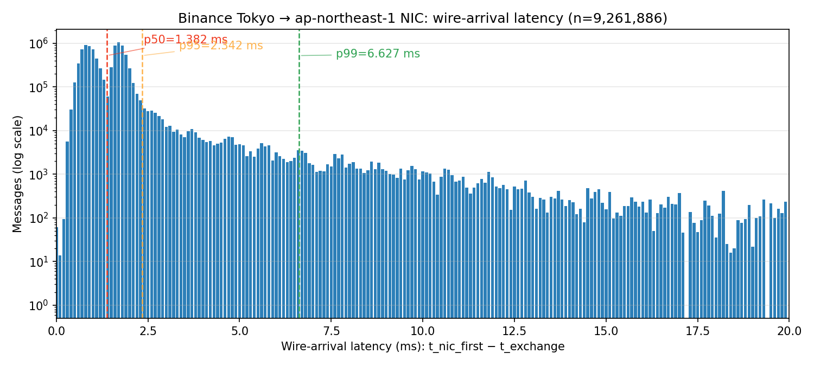
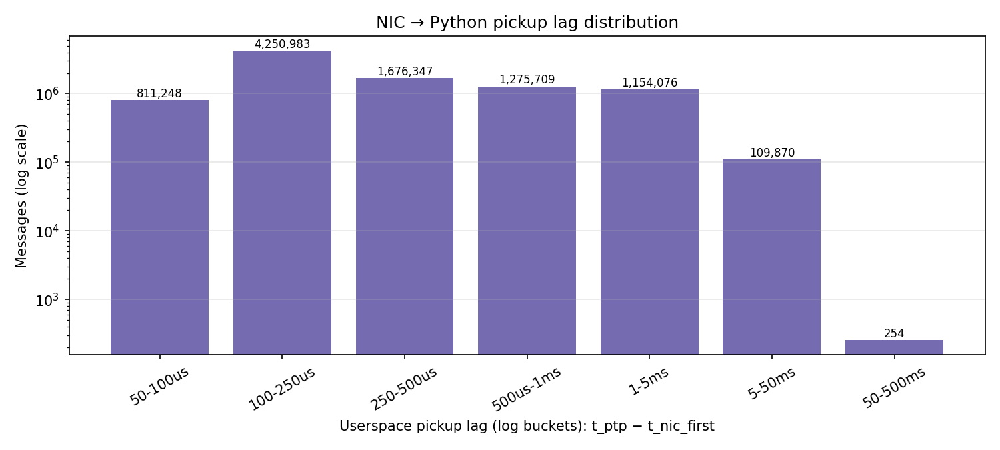
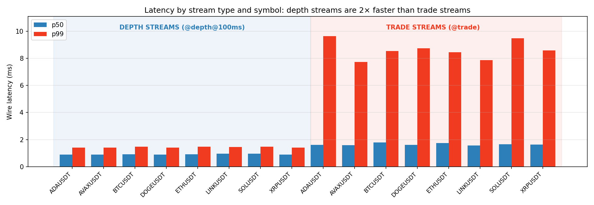
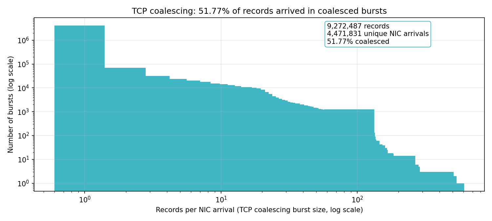
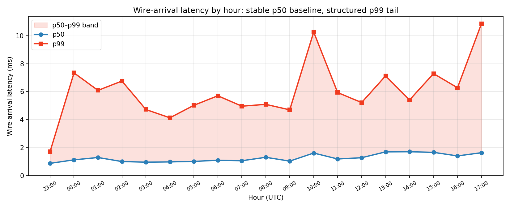
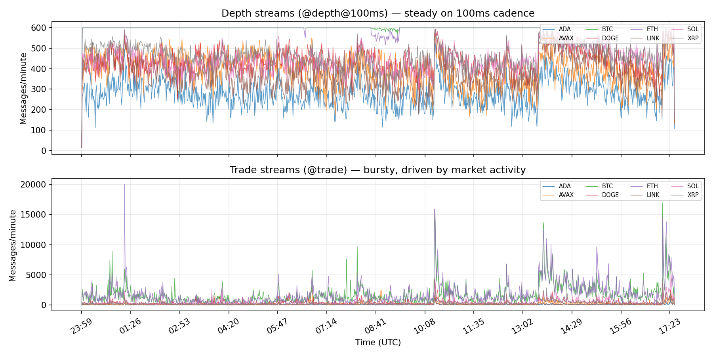

# A PTP-disciplined, NIC-hardware-timestamped market data recorder for cross-venue latency analysis

**Project:** aws-ptp-crypto-recording, a PTP-synchronized cross-exchange market data recording pipeline
**Course:** IE421 High Frequency Trading, Spring 2026, Group 19
**Contributors:** Yichen Yan (yichen32), Arya Chhabra (aryac5)
**Supervisor:** Professor David Lariviere

---

## Abstract

We built a market data recorder that captures cryptocurrency exchange feeds with two independent high-precision clocks: a network-card hardware timestamp stamped on the wire by the NIC silicon, and a PTP-disciplined userspace clock accurate to sub-microsecond precision. The recorder runs on AWS `m7g.medium` (ARM Graviton) in `ap-northeast-1` (Tokyo), co-located with Binance's matching-engine region, and writes self-describing Parquet that a lab tier pulls from S3. Over a continuous 17.51-hour window we recorded 9,257,886 Binance records across 16 streams (8 symbols, each with a depth and a trade stream) in 14,243 files. Wire-arrival latency, the NIC hardware timestamp of the first packet minus the exchange-reported event time, has a median of 1.382 ms and a 99th percentile of 6.627 ms; the userspace pickup lag between the NIC stamp and the application clock has a median of 211 µs. Three findings carry beyond the dataset. AWS Nitro RX hardware timestamping requires a device-level `SIOCSHWTSTAMP` ioctl beyond the `SO_TIMESTAMPING` socket option, and without it the timestamps silently return zero (ADR-0012). 51.77% of records arrived coalesced, overwhelmingly trade-stream traffic (87.05% versus 0.46% for depth). Stream type, not symbol, dominates latency variation, with trade-stream tail latency roughly six times depth's.

---

## 1. Introduction and motivation

In US equities, a single regulated utility, the Securities Information Processor (SIP), consolidates every exchange's quotes and trades into one feed with one authoritative set of timestamps. Cryptocurrency markets have no such utility. Each exchange runs its own matching engine, keeps its own clock, and self-reports the time of every event against that clock. A unified cross-venue view requires knowing not when each exchange _says_ an event happened, but when its data actually _arrived_ at a fixed observation point. The differences that matter are small: when two venues report events milliseconds apart and each clock drifts by a comparable amount, the true ordering can invert. NTP leaves enough uncertainty to make such inversions plausible, so every observation must be stamped against one common, high-precision reference clock.

We are deliberate about scope. We built a measurement substrate: a recorder that captures feeds with NIC-hardware and PTP timestamps, a uniform schema, and a baseline characterization of one venue. We did not build a production ticker plant with a real-time consolidated book, fan-out, and failover. We also bound what is measurable: we observe the interval from an exchange's reported event time to our NIC's hardware-stamped arrival, but cannot decompose it into network-transit and exchange-internal components, because we observe only one end of the path.

## 2. Architecture: a two-tier split between lean recorders and a heavy analysis tier

The system separates recording from analysis into two tiers, mirroring how production firms separate capture reliability from analytical complexity. The cloud tier runs lean collectors, one per venue on its own EC2 instance near that venue's matching engine, each attaching timestamps, writing Parquet, and syncing to a per-region S3 bucket every five minutes. The lab tier runs on a single VM that pulls from S3 (`S3ParquetSource`), validates sequence continuity (`validator`, seq-num gap detection), builds per-venue L2 order books (`book_builder`), and runs analysis. Decoupling the tiers keeps the recorders simple while all analytical weight lives downstream, where it can fail and restart without losing data.

```
  CLOUD TIER  (one EC2 per venue, near the matching engine)

  Binance WS (data-stream.binance.vision)
      |
      v
  RawWebSocketClient        raw socket; we own the WS framing
      |
      v
  wsproto + ssl.MemoryBIO   TLS + WS framing in userspace
      |
      v
  recvmsg per chunk
      |   SO_TIMESTAMPING + SIOCSHWTSTAMP ioctl (NIC HW RX):
      |     t_nic_first_ns / t_nic_last_ns  (stamped on the wire)
      |     t_ptp_ns  (clock_gettime, chrony -> PHC0)
      v
  LocalParquetSink -> S3 sync (5 min) -> s3://group19-ptp-<region>/

  LAB TIER  (single VM, pulls continuously)

  S3ParquetSource -> validator (seq-num gaps)
                  -> book_builder (per-venue L2) -> analysis
```

Three swappable abstractions decouple local development from cloud production, selected by the `RECORDING_CONFIG` environment variable (ADR-0004). `TimestampSource` has a laptop implementation (`ClockGettimeSource`), a PTP-disciplined EC2 implementation (`PTPClockGettimeSource`), and a NIC-hardware implementation (`NICHwTimestampSource`). `RecordSink` writes Parquet locally (`LocalParquetSink`) or to S3 (`S3ParquetSink`), and `RecordSource` reads it back for the lab tier (`LocalParquetSource`, `S3ParquetSource`). Migrating from a laptop to production EC2 is a configuration flip, not a rewrite, so we developed and tested the whole pipeline locally before Tokyo.

The architecture is designed to extend to four additional regions matching each venue's matching-engine geography; deployment is future work. Cost analysis (ADR-0008) selected `m7g.medium` at roughly \$30 per month as the cheapest PTP-supported instance, with the Intel `m7i.large` a viable alternate at roughly twice the cost.

## 3. PTP infrastructure and the latency budget

PTP is the right reference because NTP's uncertainty is comparable to the latencies we measure. NTP synchronizes over the same congested paths it times, with a millisecond-scale error budget; PTP, disciplined to a hardware reference clock, holds sub-microsecond accuracy, the difference between signal and noise when events are separated by single-digit milliseconds.

On AWS the Time Sync service exposes a PTP hardware clock through the ENA driver as `/dev/ptp_ena` (resolving to `/dev/ptp0`, device `ena-ptp-05`). chrony references it with a `refclock PHC /dev/ptp_ena` line and disciplines the system clock; application code then reads `clock_gettime(CLOCK_REALTIME)` and gets PTP-quality time with no special library. The clock state on the Tokyo box during the recording window:

```
Reference ID    : 50484330 (PHC0)
Stratum         : 1
Ref time (UTC)  : Thu May 21 17:00:16 2026
System time     : 0.000000067 seconds slow of NTP time
RMS offset      : 0.000000118 seconds
Frequency       : 17.554 ppm fast
Skew            : 0.084 ppm
Root delay      : 0.000010000 seconds
```

The RMS offset is 118 ns and the system clock sits 67 ns from reference, setting the precision floor for every userspace timestamp.

A PTP-_disciplined_ userspace timestamp is not a NIC _hardware_ timestamp: the clock is excellent in both cases, but the _stamping point_ differs. A userspace `clock_gettime` is read when `recv()` returns, tens to hundreds of microseconds after the NIC saw the bytes, absorbing scheduling and TLS-decryption time; a NIC hardware timestamp is written by the card's silicon on arrival, before any software runs. We capture both, so the schema carries exactly two measured stages, not three: there is no intermediate kernel-software timestamp, because the collector reads NIC ancillary data and then takes one userspace clock reading.

**Table 1: Latency budget decomposition (two measured stages).**

| Stage                            | Stamped at                              | Typical (p50)      | Tail (p99)         |
| -------------------------------- | --------------------------------------- | ------------------ | ------------------ |
| Exchange matching engine emit    | in payload, ms precision                | (not decomposable) | (not decomposable) |
| Exchange to NIC (wire-arrival)   | t_nic_first_ns (HW, ns)                 | 1.382 ms           | 6.627 ms           |
| NIC to Python userspace (pickup) | t_ptp_ns minus t_nic_first_ns           | 211 µs             | 5.977 ms           |
| Total observed                   | t_ptp_ns minus t_exchange_ns (delta_ns) | ~1.59 ms           | ~12.6 ms           |

The total-observed row sums the two stage percentiles and is approximate, since percentiles do not add exactly. The wire-arrival stage is the clean signal, hardware-stamped and independent of application load; the pickup stage carries userspace contention, a tail far wider than its median (Section 5).

**Table 4: System validation.**

| Component            | Mechanism                                | Verified | Evidence                                                            |
| -------------------- | ---------------------------------------- | -------- | ------------------------------------------------------------------- |
| Clock discipline     | chrony to PHC0                           | sub-µs   | 118 ns RMS offset, 67 ns system offset                              |
| NIC HW timestamping  | SO_TIMESTAMPING + SIOCSHWTSTAMP          | yes      | ethtool capabilities + non-zero stamps on all latency-valid records |
| Schema integrity     | delta_ns == t_ptp_ns minus t_exchange_ns | 100.0%   | 9,854,401 of 9,854,401 rows match exactly, 0.0 ns max residual      |
| Continuous recording | uninterrupted 17.51 h                    | yes      | gap-free hourly timeline, every minute populated (chart 06)         |

### 3a. The AWS Nitro SIOCSHWTSTAMP finding

This is the report's featured empirical contribution, because the AWS documentation does not cover it for the Python `recvmsg` path. AWS Nitro and the ENA driver support RX hardware timestamping, but the feature ships disabled by default. Setting the `SO_TIMESTAMPING` socket option with the `SOF_TIMESTAMPING_RX_HARDWARE` flag is necessary but not sufficient. The ENA driver only attaches hardware timestamps once RX hardware timestamping is enabled at the device level, and that device-level toggle is separate from the socket option.

The symptom is a silent failure. The socket option is accepted without error, WebSocket frames continue to flow, and the application looks healthy, yet `recvmsg` ancillary data returns a zero hardware timestamp on every packet. Nothing logs an error, because nothing failed: the kernel simply has no hardware stamp to hand back, so the timestamp source silently degrades to its software fallback. A naive deployment would record millions of records with a zeroed NIC timestamp column and not notice until analysis.

The fix is a device-level ioctl. `SIOCSHWTSTAMP` with `HWTSTAMP_FILTER_ALL` flips the RX configuration from `0` to `1` in `/sys/class/net/<iface>/device/hw_packet_timestamping_state` (observed interface `ens5` on the Tokyo box). After the ioctl, the same `recvmsg` path returns genuine nanosecond hardware stamps. The interface's hardware capabilities confirm the feature is present and that the filter mode we need is supported:

```
ethtool -T ens5 capabilities:
  hardware-receive
  HWTSTAMP_FILTER_ALL  (under Hardware Receive Filter Modes)

/dev/ptp_ena -> /dev/ptp0 (ena-ptp-05)
```

We codified the fix as `infra/scripts/enable-hw-timestamping.sh`, an idempotent script that applies the ioctl and is safe to re-run. It runs as a systemd `ExecStartPre` directive with the `+` prefix so it executes as root regardless of the service user, and its idempotence matters because both the baseline and NIC collectors may start and restart independently. A fresh region picks it up through `git clone` plus `install.sh` with no manual step.

This finding matters beyond our deployment. AWS documentation covers PTP clock discipline through chrony and PHC0, and mentions `SO_TIMESTAMPING` in passing, but does not state that the device-level RX-timestamping toggle must be flipped through `SIOCSHWTSTAMP` for the Python `recvmsg` path to see hardware stamps. Anyone reproducing NIC hardware timestamping in Python on AWS Nitro will hit the same silent zero-timestamp degradation without it, which is why we preserve it as a first-class result in ADR-0012's deployment addendum rather than a footnote. After the fix, NIC hardware timestamps populate every latency-valid record on Tokyo, and the userspace jitter between the hardware stamp and the application clock measures 153 µs at the median for depth streams and 1.0 ms for trade streams.

## 4. Implementation: one collector pattern and a uniform schema

The collector package is built around one abstract base class, `Collector`, with venue subclasses registered in an `EXCHANGES` dictionary the entrypoint resolves by name. Each EC2 instance runs one venue; adding one means writing a subclass, registering it, and adding a YAML entry, with no framework changes. NIC variants subclass the baseline, override only `run()` to own the WebSocket framing, inherit `parse()`, and split the sink path by venue. The Binance NIC collector is the deployed reference implementation.

The NIC-hardware path is the subject of ADR-0012. The high-level `websockets` library buffers ahead of the kernel socket and drains the ancillary data before any external consumer can read it, blocking direct `SO_TIMESTAMPING` use (the Q7 finding, Section 8). Our path owns the framing in userspace: a raw socket client (`RawWebSocketClient`) feeds `recvmsg` chunks (each a byte count and a NIC timestamp), bytes flow through `ssl.MemoryBIO` for TLS, and `wsproto` reassembles messages, so per-packet metadata falls out for free.

### The record schema

Every record carries the same columns regardless of venue, which makes the lab tier venue-agnostic. The schema preserves the raw message verbatim alongside four timestamps and per-packet detail:

| Column            | Type            | Meaning                                                                                       |
| ----------------- | --------------- | --------------------------------------------------------------------------------------------- |
| `venue`           | string          | e.g. `binance`                                                                                |
| `symbol`          | string          | e.g. `BTCUSDT`                                                                                |
| `stream`          | string          | e.g. `btcusdt@trade` or `btcusdt@depth@100ms`                                                 |
| `t_exchange_ns`   | int64           | exchange-reported event time from the payload `E` field, ms precision padded to ns            |
| `payload_json`    | string          | full raw WebSocket message body, preserved for replay and post-hoc extraction                 |
| `t_ptp_ns`        | int64           | userspace `clock_gettime(CLOCK_REALTIME)` at `recv()` return, PTP-disciplined                 |
| `t_nic_first_ns`  | int64           | NIC hardware timestamp of the first packet of the message                                     |
| `t_nic_last_ns`   | int64           | NIC hardware timestamp of the last packet; equals `t_nic_first_ns` for single-packet messages |
| `packet_metadata` | list of structs | per-packet byte count and NIC timestamp                                                       |
| `delta_ns`        | int64           | pre-computed `t_ptp_ns` minus `t_exchange_ns`, redundant but convenient                       |

Two coalescing concepts recur in Section 5. _Inter-message_ coalescing is when distinct WebSocket messages share one TCP packet, so multiple records carry the same `t_nic_first_ns` (the 51.77% finding). _Intra-message_ coalescing is when one message spans multiple packets, visible as `t_nic_last_ns` greater than `t_nic_first_ns`. The dual `t_nic_first`/`t_nic_last` columns and `packet_metadata` exist to make both observable.

A representative AVAXUSDT trade record makes this concrete:

```
venue:          binance
symbol:         AVAXUSDT
stream:         avaxusdt@trade
t_exchange_ns:  1779122480681000000
payload_json:   {"e":"trade","E":1779122480681,"s":"AVAXUSDT","t":433128135,
                 "p":"9.09000000","q":"0.59000000","T":1779122480679,
                 "m":true,"M":true}
t_ptp_ns:       1779122480689507033
t_nic_first_ns: 1779122480683400277
t_nic_last_ns:  1779122480683400277   (single-packet message)
packet_metadata: [{"byte_count": 3763, "t_ns": 1779122480683400277}]
delta_ns:       8507033
```

Reading the timestamps decomposes the record's life:

```
Exchange -> NIC:   t_nic_first - t_exchange = 2,400,277 ns (~2.4 ms)
NIC -> userspace:  t_ptp - t_nic_first      = 6,106,756 ns (~6.1 ms)
Total observed:    delta_ns                 = 8,507,033 ns (~8.5 ms)
Binance (E - T):   1779122480681 - 1779122480679           = 2 ms
```

The payload's `E` is the matching engine's event time and `T` the trade's transaction time, so `E` minus `T` (2 ms here) is Binance's internal emit lag, read straight from the preserved JSON. This record's 6.1 ms pickup is far above the 211 µs median, the userspace contention the schema is designed to expose.

Two design surprises shaped the implementation (Section 8). The `@depth` coalescing finding (ADR-0006 superseded by ADR-0010) showed Binance's unbatched `@depth` stream batches at roughly 1 Hz with about 130 events per frame, driving the dual-stream `@depth@100ms` plus `@trade` measurement contract. The ctypes microbenchmark showed a direct `ctypes` clock call was about 18 times slower than `time.time_ns()`.

## 5. Empirical findings: wire-arrival latency is dominated by stream type and shaped by coalescing

This section reports the Tokyo deployment over the 17.51-hour window. Two analysis passes produced these results: a primary snapshot pass over latency-valid records (both an exchange and a NIC timestamp) counts approximately 9.26M records, and a supplementary full-scan pass, used for the schema-sanity, symbol-volume, and coalescing-by-type tables, counts approximately 9.85M over the same glob. We cite each statistic against its own denominator. Two analysis passes ran sequentially against an actively-recording directory; the snapshot pass measured 9,257,886 records and the supplementary pass measured 9,855,373. The ~597K difference reflects continued collector writes between passes. A check at report submission time showed 11,223,089 records across 17,273 Parquet files, evidence the system was recording continuously throughout and beyond the analysis window.

### Coverage

The recorder ran continuously for 17.51 hours, from roughly 23:00 UTC on 2026-05-20 through 17:00 UTC on 2026-05-21, producing 9,257,886 records across 14,243 Parquet files and 16 streams: 8 symbols (ADAUSDT, AVAXUSDT, BTCUSDT, DOGEUSDT, ETHUSDT, LINKUSDT, SOLUSDT, XRPUSDT), each with a depth and a trade stream. ETHUSDT (28.02%) and BTCUSDT (27.27%) together account for 55% of records.

### Wire-arrival latency



Wire-arrival latency has a median of 1.382 ms, a mean of 1.481 ms, and a standard deviation of 1.644 ms. The body is tight and the tail is heavy: p75 1.757 ms, p90 1.962 ms, p95 2.342 ms, then p99 jumps to 6.627 ms, p99.9 to 17.692 ms, and the worst observation to 213.992 ms. The jump from a 2.342 ms p95 to a 6.627 ms p99 marks a small population of slow events, almost entirely trade traffic.

### Userspace pickup lag



The pickup lag isolates the cost of moving a packet from wire into application. Its median is 211 µs, the routine cost of TLS decryption and scheduling, but its tail is dramatic: p95 1,849 µs, p99 5,977 µs, p99.9 16,328 µs, max 206,429 µs (roughly 206 ms, an asyncio scheduling stall under burst). This degrades the `t_ptp_ns` claim, because the application clock was read late, but does not touch `t_nic_first_ns`, stamped in hardware on arrival, which is why the schema carries both clocks.

### Stream type is the dominant axis of variation



Latency splits on stream type, not symbol. Depth streams are fast and consistent across all eight symbols, with medians of 0.89 to 0.96 ms and p99s of 1.40 to 1.48 ms. Trade streams are slower and far heavier-tailed, with medians of 1.57 to 1.78 ms and p99s of 7.7 to 9.6 ms.

**Table 2: Stream type comparison.**

| Metric                        | Depth streams (8) | Trade streams (8) | Ratio |
| ----------------------------- | ----------------- | ----------------- | ----- |
| Mean of per-stream p50        | 0.91 ms           | 1.65 ms           | 1.8x  |
| Mean of per-stream p99        | 1.44 ms           | 8.63 ms           | 6.0x  |
| Total records (latency-valid) | 3.78 M            | 5.49 M            | 0.69x |
| Coalescing % (full-scan pass) | 0.46%             | 87.05%            | n/a   |

The coalescing row uses full-scan denominators (3.96 M depth, 5.90 M trade), not the latency-valid counts above it. The qualitative result is denominator-independent: depth records almost never share a NIC arrival, while the overwhelming majority of trade records do. Stream type explains both the latency tail and the coalescing.

### TCP coalescing is overwhelmingly a trade-stream phenomenon



Across the full scan, 9,272,487 records resolve to only 4,471,831 unique NIC arrival timestamps, so 51.77% arrived coalesced. The blended figure understates the concentration: depth streams coalesce at 0.46% (1.0 record per arrival), while trade streams coalesce at 87.05%, averaging 7.72 records per arrival. Most arrivals carry a single record (4,111,279), but a long tail bundles dozens, clustering around 94 to 95 per burst with a maximum of 434 on one NIC timestamp. This vindicates the dual `t_nic_first`/`t_nic_last` schema and `packet_metadata`: a single timestamp per message would have hidden that more than half the trade feed arrives in TCP-coalesced bursts. The cause is structural, since `@depth@100ms` emits one frame every 100 ms while individual trades bunch on the wire when activity spikes.

### Per-record statistics carry the coalesced trade tail

Within a coalesced trade burst, every record shares one `t_nic_first_ns` but carries its own earlier `t_exchange_ns`, so per-record latencies fan out and the oldest events show the largest latency. Deduplicating to one latency per unique NIC arrival removes that fan-out.

**Table 3: Per-record versus per-burst latency.**

| Stat | Per-record | Per-burst (dedup t_nic_first_ns) |
| ---- | ---------- | -------------------------------- |
| n    | 9,261,886  | 4,695,164                        |
| mean | 1.481 ms   | 1.015 ms                         |
| p50  | 1.382 ms   | 0.944 ms                         |
| p95  | 2.342 ms   | 1.673 ms                         |
| p99  | 6.627 ms   | 1.899 ms                         |
| max  | 213.992 ms | 213.992 ms                       |

The columns differ markedly: the per-burst p99 of 1.899 ms is roughly a quarter of the per-record 6.627 ms, because dedup collapses the trade-burst tail to a depth-like distribution. Both are meaningful: per-record describes what each market event experienced (event-level analysis), per-burst what each distinct wire arrival experienced (the network path). The maximum is identical because the worst event survives dedup.

### Diurnal structure: stable medians, tail spikes on the trading overlap





Hour by hour, the median is stable while the tail breathes with activity. The hourly p50 holds a narrow band, roughly 0.96 ms in the quiet early-morning UTC hours to 1.71 ms in the busy afternoon. The p99 swings widely with volume, peaking at 10.262 ms (10:00 UTC) and 10.862 ms (17:00 UTC), with secondary elevation at 13:00 (7.13 ms) and 15:00 (7.29 ms), all in the European and US overlap. The busiest hours (13:00 at 810,027 records, 14:00 at 761,694) carry the widest pickup tails, a load-induced userspace effect, not a clock problem. Recording is gap-free: every hourly bucket from 23:00 UTC and every minute is populated.

### Network event reconstruction: a correlated stall at 16:38 UTC

The minute-by-minute reconstruction of 16:20 to 16:45 UTC shows two distinct tail phenomena. Around 16:34 to 16:38 a burst drives the per-minute mean to 2.615 ms (16:34) and p99 to 35.796 ms, with a volume surge at 16:36 to 16,046 records, roughly double baseline. The top outliers split the burst in two. At 16:34:46 a cluster of LINKUSDT trade records hit the dataset's worst latency, 213.992 ms, with large pickup lag too (39 to 41 ms): large wire plus large pickup means a userspace scheduling stall. At 16:38:18 the depth snapshots of four symbols (BTCUSDT 211.701 ms, ETHUSDT 211.260 ms, XRPUSDT 209.260 ms, LINKUSDT 180.260 ms) spiked within roughly 430 µs of one another, yet pickup lags were small (168 to 448 µs): large wire across symbols simultaneously, with small pickup, means a wire or capture stall, not the application. Same wall-clock neighborhood, opposite signatures, distinguishable only because we timestamp at both the NIC and userspace.

### Threats to validity

The dataset is a single venue from a single region, so every multi-region claim is architectural, not empirical. The window is 17.51 hours, capturing intraday diurnal structure but not weekly patterns. The instance is `m7g.medium`, a defensible cost choice but a constraint that might shift the pickup tail. The `payload_json` column preserves every raw message, invaluable for replay but the largest contributor to on-disk size and a candidate for schema cleanup. The userspace pickup maximum of roughly 206 ms is an asyncio stall; it does not affect `t_nic_first_ns` accuracy but bounds `t_ptp_ns` claims at the extreme tail. Finally, the roughly 6% record-total discrepancy noted above is unresolved.

## 6. What we built versus what is future work

Multi-region deployment (Coinbase in `us-east-1`, Polymarket in `eu-west-2`, Kalshi in `us-east-2`, OKX in `ap-east-1`) is mapped and the collectors are built, but not deployed. The NIC-hardware path runs in pure Python via wsproto and `ssl.MemoryBIO` (ADR-0012), with C++ Boost.Beast as the mapped fallback. A real-time consolidated cross-venue book, fan-out, and ML anomaly detection remain open.

## 7. Individual contributions

Individual attribution is captured by the gitlab commit history. Team biographies and contact information appear below in the Team section.

## 8. Lessons and findings

Five results share a shape: the obvious assumption was wrong, and only measurement revealed it.

- **SIOCSHWTSTAMP (Section 3a).** AWS Nitro NIC timestamping needs a device-level ioctl beyond the socket option, or stamps silently return zero. Verify non-zero output before trusting a precision feature.
- **@depth coalescing (ADR-0006 to ADR-0010).** Binance's "unbatched" `@depth` batches at 1 Hz with roughly 130 events per frame, worse than `@depth@100ms`. Measure a feed's fan-out, do not infer it from its name.
- **websockets buffering (Q7, ADR-0012).** The high-level library drains socket ancillary data ahead of any consumer, so direct `SO_TIMESTAMPING` returns nothing useful, which forced owning the framing layer.
- **ARM64 misdiagnosis (ADR-0008).** Early ENA driver errors on `m7g.medium` read as "ARM64 doesn't support PTP" until `phc_enable=1` fixed it. Verify root cause before re-architecting.
- **ctypes microbenchmark.** A direct `ctypes` `clock_gettime` was about 18 times slower than `time.time_ns()` from marshalling overhead. Faster in principle was slower in practice.

## 9. Handoff for continuation

The next concrete task is ADR-0012 P2 (the wsproto and `ssl.MemoryBIO` path) deployed to additional regions; open decisions live in `docs/decisions/`. AWS credit allocation remains TBD; coordinate with course staff before scaling beyond the Tokyo deployment.

**Reproducibility.** To reproduce this result: provision an `m7g.medium` in `ap-northeast-1` with the latest Amazon Linux 2023. Run `infra/scripts/install.sh`. Set the `phc_enable=1` kernel parameter. Run `infra/scripts/enable-hw-timestamping.sh` as a systemd `ExecStartPre`. Then start the collector with `systemctl start group19-collector@binance_nic`. Verify the clock and the NIC with `chronyc tracking | grep PHC0` and `ethtool -T ens5 | grep hardware-receive`.

---

## Team

### Yichen Liu

Graduating senior in Mathematics & Computer Science at the University of Illinois Urbana-Champaign.
Designed and deployed the project's recording infrastructure: provisioned the PTP-synchronized AWS instance, configured the hardware clock discipline, and built the NIC-hardware-timestamping collector that produced the 9.3-million-record dataset for Binance on Tokyo EC2. Interested in crypto and prediction markets in HFT systems, full-stack software engineering. Open to full-time opportunities in the US.

- GitLab: @yichen32
- GitHub: https://github.com/GeneralCorn
- LinkedIn: http://linkedin.com/in/yichenliu040215/
- Email: yichen32@illinois.edu

### Arya Chhabra

[bio TBD, to fill in before submission]

- GitLab: @aryac5
- GitHub: [TBD]
- LinkedIn: [TBD]
- Email: [TBD]
